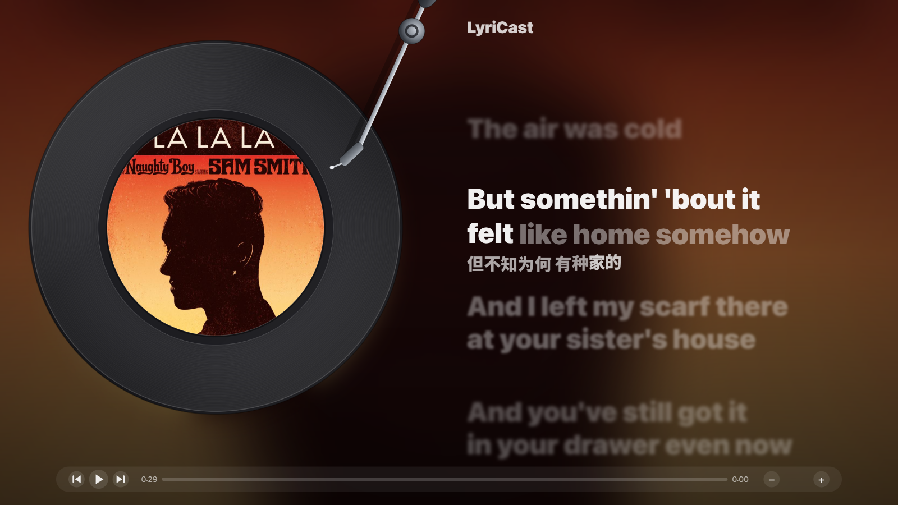
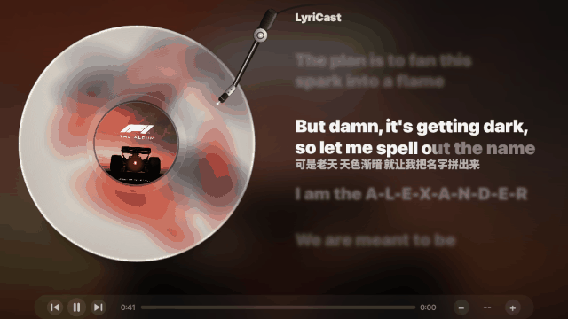

# LyriCast · 局域网音箱歌词条

给你的 WiFi 音箱配一个「Apple Music 风格」的桌面歌词条：半透明、置顶、逐行同步、
当前行左→右填充高亮、平滑滚屏、专辑封面模糊背景；还有一台**黑胶播放器**全屏视图
（左侧转盘 + 右侧大字同步歌词 + 底部控制条）。

它不挑音箱品牌：直接读音箱自己的播放状态（标准 UPnP/DLNA 或 Sonos 私有接口），
所以 **Sonos / WiiM / 天龙 HEOS / 雅马哈 MusicCast / Bluesound / Volumio /
foobar2000 的 UPnP 输出……** 都能用；Windows 上还能读**电脑自己的媒体会话**
（Apple Music / Spotify 桌面端，包括从电脑 AirPlay 到 HomePod）。

> 说明：音箱官方 App 一般不支持插件，所以这是一个**独立的伴生小窗**，
> 它自己去读音箱的播放状态，再把歌词画出来。
>
> ⚠️ **HomePod / AirPlay 音箱例外**：AirPlay 2 不对外提供播放元数据，
> HomePod 也没有 DLNA 接口，「直读」走不通 —— **在 LyriCast 里搜不到它是正常的**。
> 可行方案（同时投送给 Sonos 当“元数据代理” / 电脑端媒体会话 / 麦克风指纹）见
> **[docs/BACKENDS.md](docs/BACKENDS.md)**；程序里也有入口：托盘菜单 →「HomePod / AirPlay 搜不到？」。





---

## 快速开始

```bash
git clone https://github.com/ChandlerYancug/LyriCast.git && cd LyriCast
py -3 -m pip install -r requirements.txt
run.bat            # Windows；其它平台： python3 main.py
```

> **装不上依赖？**（国内访问 PyPI 慢 / 超时）换清华镜像再试：
> `py -3 -m pip install -r requirements.txt -i https://pypi.tuna.tsinghua.edu.cn/simple`
>
> **提示找不到 Python？** 去 <https://www.python.org/downloads/> 下载安装，
> 安装时勾选 “Add python.exe to PATH”，之后直接双击 `run.bat` 即可。
>
> **想要逐词歌词 + 官方翻译？** 需要一分钟配置一次 Apple Music 凭证，
> 见下方「Apple Music 源」一节（不配也能用，只是普通歌词）。
>
> **编码不用管**：中文 Windows 默认 GBK，程序会自动把输出统一切成 UTF-8
>（`utf8mode.py`），歌词 / 日志 / 中文路径里的任意字符都能正常显示。

启动后它会自动在局域网里找音箱（Sonos 和通用 DLNA 一起问）。找到就开始显示；
找不到会把提示写在窗口里，也可以手动把音箱地址填进 `config.json`
（`speaker_host`；DLNA 音箱再填上 `speaker_location`，即设备描述 URL）。
配置模板见 `config.example.json`。

也可以完全不管配置：**托盘菜单 → 选择音箱** 里列出了搜到的设备（同名设备带 IP
区分），点一下就切过去；断线会自动重新搜索；Windows 装了 `smtc` 依赖后菜单里
还会有「本机媒体会话（电脑在放歌时用）」。

## 依赖

- Python **3.11+**（CI 在 3.11 / 3.13 上验证；更老的版本没测过）
- 必需：`PyQt6` / `requests` / `pillow`，以及 `browser_cookie3`（只被
  `get_apple_token.py` 用到，不配 Apple 凭证就轮不到它）—— 换电脑时一条命令全装：
  `py -3 -m pip install -r requirements.txt`
- 可选（按需装，在仓库目录里执行）：`pip install -e ".[smtc]"`（Windows 系统媒体会话）、
  `.[dev]`（测试与 lint）；`.[listen]`（麦克风指纹，路线图）；见 `pyproject.toml`
- 字体：**开箱即用** —— 仓库随带 OFL 开源字体（拉丁 [Inter]，中文思源黑体子集
  Noto Sans S Chinese），clone 下来不装任何东西就是设计好的观感；原版的
  SF Pro Display 因版权不随仓库分发，已有的话放进 `fonts/` 会自动优先使用，
  详见 `fonts/README.md`

---

## 全屏播放器（黑胶模式）

**默认就是它**：双击桌面图标进来的就是黑胶播放器（窗口形式）。
也可以从悬浮歌词条双击、或托盘菜单打开。

窗口 ↔ 全屏切换：**双击画面** / **`F11`** / 右键菜单 / 托盘菜单。

### 画面效果（仿 Apple Music）

- **渐进模糊（景深毛玻璃）**：AMLL 原值 σ = min(5, 1+距焦点行数) —— 下一行就给到 σ2、
  逐行化开（3 → 4 → 5 封顶），已唱过的行等效距离 +1；模糊变化带平滑过渡；
  非当前行的位图**直接在目标缩放下渲染、1:1 贴图**（既不做二次缩放，也不做重采样），
  一串词全是同一道高斯 —— 不会出现“每个词糊得不一样”；位图按屏幕缩放
  （125%/150%/200%）以物理分辨率渲染 —— 高 DPI 屏上依旧干净；
  高斯在**预乘 alpha** 空间里做（透明区不污染颜色）—— 字缘不会出现一圈“描边”
- **亮度体系（对齐 AMLL）**：非焦点行按距焦点的距离压暗（相邻 0.36 → 远景 0.20），
  滚动时亮度平滑过渡 —— 低对比度 + 模糊才是“毛玻璃”，高亮度的模糊只会显得“糊字”
- **填充软边**：当前行“已唱（亮）/未唱（暗）”的交界不是硬切边，而是约 0.5×行高的
  横向渐变（AMLL `wordFadeWidth` 默认值），像一条光带扫过歌词
- **逐词上浮**：唱到的词会轻轻向上浮 0.05em（`ease-out`、时长 max(1s, 词长)，
  AMLL 的 float 动画原样移植）——长句里每个词的“起唱感”更明显
- **上方只留一行**：被滚走的歌词只保留紧邻的一行，再往上随滚动淡出消失，
  画面留给当前句和下方即将到来的句子
- **模糊封面背景**：背景不再是单色主题光晕，而是封面本身大幅模糊后的彩色柔光
  （AMLL 方案）；亮度按封面自适应，换歌时 0.5s 交叉过渡
- **字体**：拉丁默认 **SF Pro Display**（苹果官方西文字体，随包在 `fonts/`，最重到
  **Black** 面——歌词正文和翻译都用 Black 档，个人自用不外传）；中文默认回退
  **思源黑体 / Noto Sans SC**（同样有 Black，开源的重量级黑体）。两者用 Qt 的
  families 链逐字符回退（拉丁→SF、汉字→中文），所以一行“中英混排”也能各自用对字体。
  `config.json` 里 `font_family`（拉丁）、`cjk_font`（中文）可随意换：`MiSans` /
  `HarmonyOS Sans SC` / `Alibaba PuHuiTi 2.0` / `PingFang SC` …（缺字重时会自动降一档）
- **间奏点**：两句之间长间奏（≥7 秒）时，上一句下方**紧贴**浮现三颗呼吸的白色圆点：
  依次点亮 → 随音乐脉动缩放 → 下一句临近时放大收缩、恰好退场；大小 / 间距 / 时序
  全部取自 AMLL（专门逆向 Apple Music 歌词效果的社区项目）

  > 目前全屏黑胶模式支持间奏点；悬浮歌词条保持原有滚动。
- **黑胶唱片**（参考网易云黑胶的自制造型）：盘面分**三层**渲染 —— 底盘 / 花纹 /
  表层（沟槽 + 导入槽 + 外缘亮环 + 斜反射）。**花纹层随盘旋转，沟槽和反光不转**
  （同心沟槽转了看不出，而反光是打在盘面上的光，不该跟着唱片转）；中心是**圆裁切的
  专辑封面当唱片标签**（随盘旋转，**中间没有中心孔/黑洞**，直径约为唱片的 58%）；
  右上角一支唱臂（枢轴底座 + 圆柱渐变铝管 + 带偏角的唱头/唱针 + 配重）斜伸到外圈
  沟槽；**暂停时唱臂向外轻抬**、盘停转
- **切歌换盘**：换歌（或按 `M` 换材质）时，旧盘面与旧封面**交叉淡入**到新盘（0.45s），
  同时唱臂抬起再落下 —— 像真的换了张唱片
- **唱片投影**：抄 [YesPlayMusic](https://github.com/qier222/YesPlayMusic) 歌词页的
  `.shadow` 做法（封面自身模糊一份、下移、略缩小、压暗当投影），唱片像浮在桌面上；
  模糊图只算一次，换封面才重算
- **彩胶材质（16 种，按歌随机）**：唱片不是永远黑胶 —— 按「歌名 + 歌手」做种子随机
  挑一款，同一首歌固定同一款（像“这张单曲压的是红胶”），换歌就换。每种材质除了
  底色，**透明感 / 花纹 / 沟槽表现 / 光泽**都不一样，不是只换颜色：

  | id | 材质 | 质感 |
  | --- | --- | --- |
  | `black` | 经典黑胶 | 近黑盘面，靠反光的亮沟槽 |
  | `white` | 白胶 | 米白实色，沟槽是**阴影**（暗线）+ 隔几圈一道细反光 |
  | `clear` | 水晶透明胶 | 半透，能透出背后的柔光底，盘边吃光发亮 |
  | `clear-red` | 透明红胶 | 透光红玉髓感 |
  | `clear-sea` | 海玻璃胶 | 透光青绿，像海边捡的玻璃 |
  | `amber` | 琥珀胶 | 半透金黄 |
  | `red` / `green` / `purple` | 正红/森林绿/霓紫胶 | 实色、光泽各有强弱 |
  | `galaxy` | 星云胶 | 压片流动方向的紫色射线条纹（角向柔边）+ 星点 |
  | `marble-red` | 红白大理石胶 | 拉长的软色浆块，像倒色时流动的纹路 |
  | `splatter` | 泼墨胶 | 不透明彩色溅点 + 细小飞溅 |
  | `glitter` | 闪粉胶 | 密集细闪 + 少量大亮片 |
  | `hologram` | 镭射胶 | 金属底 + 六向彩虹衍射 |
  | `split` | 对开双色胶（红/蓝对半） | 两半硬分色，接缝有渗色 |
  | `smoke` | 烟熏胶 | 半透灰底 + 烟雾状色块 |

  想固定一款就用 `config.json` 里的 `vinyl_material`（填上面的 id，`"auto"` 为随机）。
- **翻译“四周汇聚”入场（只在当前行）**：每个字从各自方向（确定性伪随机，稳定不跳）
  的偏移处**由虚到实**浮入到最终位置，并带几层幽灵描边做方向柔化 —— 行内时间驱动，
  暂停时自然冻结；翻译字号 0.60×、Bold 字重、亮度 0.65（后两项对齐 YesPlayMusic 的
  `.translation`：靠亮度而不是缩得很小来“退到第二层”）
  - **长翻译折成两行**：一行放不下时，在“放得下”的候选断点里挑**两行宽度最接近**的
    那个（优先断在标点 / 空格后），折出来的两行还放不下才整句缩小（缩完再量、量完再纠）；
    折出的第二行**计入行块高度**，不会压到下一句歌词身上
  - 汇聚入场按行内定位，折行后每个字仍在自己的行上飞入；入场起点贴边收进来
    （不会探出歌词区被裁掉一截）
  - **前后句不再显示翻译**：模糊的上一句/下一句只留原文，画面只给当前这句当字幕
  - **出发与飞行分开（顺滑的关键）**：出发时刻挂在主句填充进度上 —— 唱到哪个字、
    哪个字才起飞（按发声量分配时刻，中文权重比拉丁高）；**飞行本身走播放时间轴**：
    固定 0.55s 的缓出（easeOutCubic）滑入，和主句逐词上浮同一套时间轴，暂停冻结、
    seek 重来。早先版本把飞行也挂在填充上，而逐词填充在**词间空隙会冻结**，于是字会
    “飞一半停住、下一词开始时再跳一下”；现在填充冻结期间字照样平顺飞完，拖进度条
    回填时还会从左往右依次归位
- **延迟跟随**：每行一根独立弹簧 + 阶梯延迟（每行约 50ms）——行切换时上方行带头、
  下方行拖尾跟上，像橡皮筋一样把整列歌词“拖”过去
- **弹性**：正常播放为过阻尼（顺滑不回弹）；拖进度条 / 间奏后换慢速弹簧，
  轻微回弹地“飞”过去；拖进度条时直接跟手
- 所有参数取自 [AMLL](https://github.com/Steve-xmh/applemusic-like-lyrics)（专门复刻
  Apple Music 歌词效果的社区项目）对 Apple Music 的逆向参数

> 效果预览：见页面顶部的 `docs/images/player.png`（由 `dev/make_shots.py` 生成）

### 鼠标

> 底部控制条是 **dock 式自动收放**：鼠标移到屏幕下方才滑上来，
> 鼠标移开或静置约 2.5 秒后自动沉下去 —— 平时把画面完全留给歌词。

| 操作 | 效果 |
| --- | --- |
| 鼠标移到屏幕下方 | 控制条滑上来 |
| 点 ▶ / ⏸ | 播放 / 暂停 |
| 点 ⏮ / ⏭ | 上一曲 / 下一曲 |
| 点 − / + | 音量 2 格 |
| 点歌词某一行 | 跳转到这一句的开头（仿 Apple Music；鼠标移上去会变手型） |
| 拖动进度条 | 拖动时**只动界面**，松手才真正跳转（避免音箱反复重新缓冲） |
| 单击空白处 | 全屏时退回窗口 |

### 键盘

| 键 | 效果 |
| --- | --- |
| `空格` | 播放 / 暂停 |
| `←` `→` | 快退 / 快进 5 秒 |
| `Ctrl+←` `Ctrl+→` | 上一曲 / 下一曲 |
| `↑` `↓` | 音量 ±2 |
| `[` `]` | 歌词偏移 −0.05s / +0.05s（画面下方实时显示当前值） |
| `M` | 换一种彩胶材质（画面下方显示材质名） |
| `F11` | 窗口 / 全屏 切换 |
| `Esc` | 全屏时退回窗口；窗口时隐藏到托盘 |

### 视觉

- **行距恒定**：按“块与块之间的空隙”计算，所以上一句 1 行、这句 2 行、
  下一句 1 行时，**间距完全一样**，不会忽紧忽松；
- **绝不硬切右边**：折行用和绘制一致的字重（Black）量，超宽的句子（以及折行后仍放不下的
  翻译行）再按“缩完再量、量完再纠”缩到放得下 —— 字号量化会让每个字多占零点几像素，
  五十个字累起来就是十几个像素，不纠偏就会把尾巴的几个字切掉
- **左边也不硬切**：正文左对齐、紧贴歌词区左缘画，而 “j”“y” 这类字母的**墨迹会探出
  绘制原点**（负 bearing，“just …” 的首字母左钩最多探出 4px）—— 裁剪框按实测外挂
  左右放宽（只放宽裁剪、不动文字位置），第一个字母不会被左缘切掉一小条；
  模糊行的光晕同样按位图留边放宽，不会被切出一条直边
- **翻译按 baseline 绘制（不甩矩形框）**：早先用 `drawText(矩形框, AlignTop)` 逐字画，
  可矩形框会按**每个字自己的字体度量**摆位置 —— 拉丁字体（SF Pro / Inter）的 ascent
  比中文字体（思源）小一截，所以翻译里夹的英文人名会**偏上**；等整行绘制时中英又共用
  一条 baseline（取两者中较大的），英文就“往下跳一下”。现在逐字/整行两条路径都用
  `QTextLayout` 量出的**整行 baseline**（`_line_ascent`）定位，中英永远同一条线，
  顺带也没有了矩形框底裁笔画的问题（同一个回归点，两条路线各自修了一半）
- **平顺跟随**：换行时平滑滚动；**大跳（拖进度条）直接瞬移**，
  不会从中间一路滚过去；
- **缓冲期冻结**：跳转/缓冲时音箱报的位置不可信，这段不更新歌词，
  所以白色填充不会来回抖。

## 用法

### 鼠标

| 操作 | 效果 |
| --- | --- |
| 拖边框 / 拖边角 | 改变窗口大小，**字号会跟着按比例缩放** |
| 右键 | 打开菜单 |
| 拖动 | 悬浮模式下按住左键拖动 |
| 全屏时单击 / Esc | 退出全屏 |

### 右键菜单

- **重新搜索歌词**：匹配不准时手动重搜
- **全屏歌词模式（黑胶）**：大屏欣赏，左侧旋转黑胶 + 大字歌词
- **导出当前曲目信息（排查用）**：写出 `track_debug.txt`，某首歌搜不到歌词时用它
- **歌词延后 / 提前 0.5s · 0.1s**：和声音对不齐时微调（会自动记住）
- **字号 +/−**、**透明度 +/−**
- **重置窗口大小**：回到 900×300
- **悬浮模式（无边框·置顶·可锁定）**：切换成桌面歌词条形态
- **窗口置顶**：普通模式下也能置顶
- **鼠标穿透（锁定）**：只有悬浮模式下有，鼠标直接穿过去，不挡操作
  （开了之后就用**托盘图标**右键来关掉或退出）
- 隐藏 / 退出

### 托盘图标（黑胶「词」）

- 左键：显示 / 隐藏
- 右键：显示/隐藏、全屏模式、重搜歌词、导出排查信息、**重新连接音箱**、
  **重新发现音箱设备（换设备用）**、**多媒体键控制（全局）**、黑胶转速、
  **开机自启**、退出

### 全局多媒体键

开启后（托盘里可开关，默认开）：

| 按键 | 效果 |
| --- | --- |
| 播放 / 暂停键 | 播放 / 暂停音箱 |
| 上一首 / 下一首键 | 切歌 |
| 停止键 | 暂停 |

耳机、键盘上的多媒体键都算，**窗口不在前台也能用**。

> 实现上是 `RegisterHotKey` + Qt 原生事件过滤器，**零依赖**；
> 没用 SMTC/WinRT（那套需要 winsdk 这类绑定，对 Python 3.13 支持不稳）。
>
> 副作用：开启期间这几个键会被本程序接管（浏览器、其它播放器收不到），
> 所以做成了开关 —— 看视频时想抢回媒体键，关掉即可。

### 启动

- 双击桌面 **「LyriCast」** 快捷方式即可（`pythonw` 启动，无黑框；Windows）
- **默认打开的是「黑胶播放器」窗口**：有标题栏、可缩放、可最小化，
  跟普通程序一样；想全屏随时切（双击画面 / `F11` / 右键菜单）
- 想开机自动运行：托盘图标右键 → 勾上 **开机自启**
- 开发/排错时用 `run.bat`（带控制台，能看到输出）

如果想改回“启动只开悬浮小条”，把 `config.json` 里的 `start_view` 改成 `"bar"` 即可；
希望一启动就全屏，就把 `player_fullscreen` 改成 `true`。

---

## 配置项（`config.json`）

| 键 | 说明 |
| --- | --- |
| `speaker_type` | 音箱类型：`auto`（默认，自动识别）/ `sonos` / `upnp`（通用 DLNA）/ `smtc`（Windows 本机媒体会话） |
| `speaker_host` | 音箱 IP。留空则自动发现 |
| `speaker_name` | 多台音箱时指定房间名 / 友好名（如「客厅」） |
| `speaker_location` | 仅 `upnp` 需要：设备描述 URL，如 `http://192.168.1.20:49152/description.xml` |
| `font_family` / `font_size` | 拉丁字体与字号（pt）。默认优先 SF Pro Display，缺失自动回退 |
| `cjk_font` | 中文回退字体。默认 `Noto Sans SC`（思源黑体），可换 `MiSans` / `HarmonyOS Sans SC` / `PingFang SC` 等 |
| `opacity` | 背景不透明度 0.25–1.0 |
| `window_width` / `window_height` | 窗口尺寸 |
| `window_mode` | `normal`＝普通窗口（有边框/进任务栏/不置顶）；`floating`＝无边框悬浮条 |
| `always_on_top` | 是否置顶（普通模式默认 false，和其他程序一样） |
| `click_through` | 是否鼠标穿透（仅悬浮模式） |
| `show_track_info` | 顶部是否显示「歌名 — 歌手」 |
| `show_translation` | 有翻译时是否显示（网易云的中文翻译） |
| `bg_album_art` | 是否用专辑封面做模糊背景 |
| `lyrics_offset_sec` | 全局歌词偏移（秒），正数=歌词延后 |
| `vinyl_turn_seconds` | 唱片转一圈的秒数（默认 12） |
| `vinyl_material` | 唱片材质：`"auto"`＝按歌随机彩胶；也可固定填 `black` / `white` / `clear` / `galaxy` / `splatter` …（见上面彩胶表） |
| `start_view` | `player`＝启动开黑胶播放器（默认）；`bar`＝只开悬浮歌词条 |
| `player_fullscreen` | 播放器是否以全屏启动（默认 `false`＝窗口） |
| `player_size` / `player_pos` | 播放器窗口尺寸与位置，自动记录 |
| `provider_order` | 歌词源顺序，默认 `["apple", "netease", "lrclib"]` |
| `apple_storefront` | Apple 账号所在区（如 `in`、`us`）；默认自动查询账号区 |
| `window_position` | 上次窗口位置，自动记录 |

---

## 歌词从哪来

`Sonos 接口不提供歌词`，所以是用「歌名 + 歌手」去第三方库匹配：

1. **Apple Music**（默认首选）：官方歌词数据，每行带精确起止时间，跟声音对齐最好
2. **网易云音乐**（中文歌覆盖最好，还带翻译）— 非官方接口
3. **LRCLIB**（欧美歌覆盖好，开放 API）

匹配时会：

- 用播放时长做校验，避免撞到同名的现场版 / 翻唱；
- 自动去掉 `(Live)` `[Remastered]` `- 现场版` 这类后缀、拆分多歌手，
  **逐级放宽**重试（所以非标准命名的歌命中率高得多）。

所有源都匹配不上就会显示「暂无歌词」。

> 为什么 Sonos 官方 App 有歌词而这里可能没有？
> 官方 App 的歌词是**音乐服务商（Apple Music / 网易云）直接给它**的，
> 本地 UPnP 接口拿不到。用右键菜单「导出当前曲目信息」把
> `track_debug.txt` 发出来，如果里面有音源歌曲 ID，就能做按 ID 精确取词。

### Apple Music 源（默认首选：逐词 + 翻译）

Apple 的歌词是官方 TTML 数据：**逐词**带精确起止时间（白色填充贴着每个词的
演唱走，不是按整句平均），还带**官方中文翻译**。要用上它，需要配置一次你
自己账号的凭证（`am_token.txt`）：

1. **浏览器里登录** <https://music.apple.com>（保持登录状态）；
2. **在项目目录运行**（需要 `browser_cookie3`，按 README 装过 `requirements.txt` 就有）：

   ```bash
   py -3 get_apple_token.py
   ```

   脚本会从 Chrome / Edge / Firefox 里读出 `media-user-token` 并写入 `am_token.txt`；
3. **重启 LyriCast**。

读不到浏览器 cookie 时（新版浏览器会加密），手动来：F12 → Application →
Cookies → `https://music.apple.com` → 复制 `media-user-token` 的值，存成项目
目录里的 `am_token.txt`（整个文件就这一行）。

凭证有效期几个月，过期后重跑第 2 步即可；程序里也有入口：**托盘菜单 →
「Apple Music 凭证（逐词/翻译）…」**。

> `am_token.txt` 等于你的登录凭证：只存本机、自己看，**别发给别人**（已在
> `.gitignore` 里，不会被误提交）。
> **没有凭证也完全能用** —— 自动回退到网易云 / LRCLIB 的普通歌词（没有逐词与翻译）。

用你账号所在区（比如 `in`）。换了账号/区就在 `config.json` 里改
`apple_storefront`，或删掉该项让它自动查询。

逐词数据的附带福利：

- **自动翻译**：请求时带上中文偏好，Apple 返回的官方翻译会自动显示在歌词下方；
  中文歌若是繁→简差异（`replacement` 型），直接显示简体，不会同一句重复两行；
- 拿不到逐词资源的老歌会回退到普通歌词接口，一切照常显示。

## 歌词 / 封面缓存

第一次播放某首歌时，歌词和封面会自动存到本地 `cache/` 文件夹；
之后同一首歌**直接出**，不用再联网，也没有等待的空白期：

- `cache/lyrics/<key>.json`：歌词（含翻译）。"没找到"也会记下来，7 天后才重试
- `cache/art/<key>.img`：封面原图。同一张专辑共享一份，最多 300 张，旧的自动清

不想要了可以去托盘菜单 → **清空歌词/封面缓存**。

## 同步精度

### 实时事件推送（UPnP/GENA）—— 让 seek 瞬间同步

轮询有个天生的短板：Sonos 的 `RelTime` 只有 1 秒粒度，而且 seek 之后音箱要缓一下
才上报新位置，光靠轮询会“慢一两句”。

所以程序会向音箱**订阅 AVTransport 事件**：

- 你拖动进度条的**那一瞬间**，音箱主动 POST 一条事件到本机（实测延迟 **~113ms**）；
- 收到后立即去查一次真实位置，歌词在 **~150ms** 内跟上，而不是等下一轮轮询；
- 订阅有效期 300 秒，程序会自动续订；音箱重连 / 换主音箱会重建订阅。

> **首次运行会弹一次 Windows 防火墙提示**（因为需要在本机开一个接收回调的小端口）。
> 记得勾选 **“专用网络”** 并点 **允许访问**。
> 如果你点了“取消”，程序不会坏 —— 会自动退回纯轮询模式（只是 seek 后慢一点）。

如果窗口上出现 **“已启用实时事件推送 ✅”**，就说明订阅成功了。

### 其他同步细节

- 常态轮询 **263ms**（刻意避开整除数：轮询周期与 1 秒的整秒读数整除时会
  让采样相位锁定，校准带上固定偏差；263ms 让相位逐圈漂移，平均后误差趋零）；
  拖进度条后的追赶期 70ms；
- **台阶边沿时钟**：Sonos 的 `RelTime` 是向下取整的整秒值（读数 `n` 意味着真实
  位置在 `[n, n+1)`）。程序把每次 `n -> n+1` 的跳变当作“位置刚跨过整数”的
  实测信号，反推出 PC 时钟与歌曲位置的相位差，实时位置直接由该时钟推导——
  不再靠猜测补偿，从根上消掉“还没唱就开始滚 / 慢半拍”的问题；
- **样本带权 + 卡顿自愈**：轮询变慢（网络卡）时该次边沿的时刻误差按间隔成
  比例放大，程序按 `1/间隔²` 自动降权；Wi-Fi 卡顿漏了几次轮询（读数一次
  跳 2 秒）不再清掉校准，只有真正的 seek / 切歌才重建（判定思路参考 AMLL
  的 seek-detector：比对“读数推进量”与“流逝时间”）；
- 边沿尚未就绪时（刚启动 / seek 后约 2~3 秒）退回“半个采样周期”的兜底补偿；
- **暂停**时位置精确冻结（不漂移），恢复后从冻结点接续，边沿样本自动重建；
- **迟滞纠偏**：小误差不理会（滤掉读数抖动，画面不跳）；偏差 0.75s 以上时每次收敛
  1/4；seek / 切歌那种大跳直接对齐；
- **seek 免疫期**：你拖动进度条后 0.8s 内忽略在途的旧位置读数，歌词不会“闪回”一下；
- 如果整体还是偏早/偏晚，按 **`[` / `]`** 每次 ±0.05s 细调（画面下方会
  显示当前值），或右键菜单里的 0.05 / 0.1 / 0.5 秒档位；一次调好永久生效。

---

## 多房间 / 立体声配对（Sonos 专属）

> 通用 DLNA 音箱没有这套机制，本节只对 Sonos 有效。

Sonos 多房间或立体声配对时，**从机（slave）的接口不报告曲目和进度**
（`TrackURI` 是 `x-rincon:...`，`TrackMetaData` / `RelTime` 都是 `NOT_IMPLEMENTED`）。

程序会自动查 `ZoneGroupTopology`，**跟随到同组的「主音箱」**去读真实曲目，
无需手动设置。窗口上会提示「已跟随主音箱：xxx」。

## 已知限制（先说清楚，免得踩坑）

- **能读到什么，取决于音箱**：标准 UPnP/DLNA 设备各家的元数据完整度差异很大，
  有的只给标题不给歌手；Sonos 最完整（逐词 + 翻译）。建议先用
  `dev/debug_speaker.py` 导出一次原始数据再判断问题出在哪一侧。
- **HomePod / AirPlay 音箱没有网络元数据接口**（AirPlay 2 不提供），
  直读不可行；可行方案见 `docs/BACKENDS.md`。
- **逐词同步取决于 Apple 源**：主流流行歌大多有逐词数据（syllable-lyrics），
  没有的歌会自动回退到逐行同步，依然流畅；
- Apple 源的凭证（`am_token.txt`）几个月会过期一次；过期后歌词会自动回退到
  其它源，重新运行 `get_apple_token.py` 恢复。
- 如果歌词整体偏早/偏晚，用右键菜单的「延后 / 提前」微调，一劳永逸。
- 网络电台、广告时段拿不到干净的曲名歌手，匹配不到是正常的。
- 歌词有版权，**自己用没问题，别公开分发**。
- 依赖非官方的网易云接口，哪天它改了就得跟着改（LRCLIB 是官方开放接口，更稳）。
- 全局多媒体键 / 音量键接管 / 开机自启目前是 **Windows 专属**，其它平台自动禁用。

---

## 开源与隐私

- 许可证 **MIT**（见 `LICENSE`）；第三方参考项目的源码**未随仓库分发**，仅作设计参考。
- **不进仓库**的东西（见 `.gitignore`）：`config.json`（含你家音箱 IP）、
  `am_token.txt`（Apple 凭证）、`cache/`（歌词/封面缓存）、`fonts/` 里的
  SF Pro（版权字体）、`dev/` 的输出文件。
- 隐私：所有数据都在本机（局域网内音箱 + 歌词源 API + 本地缓存），
  没有遥测、不上传任何东西；Apple 凭证只用于向 Apple Music 请求歌词。
- 日志：滚动写在用户目录（Windows `%LOCALAPPDATA%\LyriCast\logs\`，其它平台
  `~/.lyricast/logs/`），托盘菜单里有“打开日志文件夹”；提 issue 时附上它。
- 歌词来自 Apple Music（非官方接口）/ 网易云（非官方接口）/ LRCLIB（开放 API），
  仅供个人本地显示，请遵守各源的条款。

---

## 开发

```bash
pip install -e ".[dev]"        # 跑测试要 Pillow；smtc 额外：.[smtc]
ruff check .                   # 静态检查（配置在 pyproject）
pytest -q                      # 离线测试（假 DLNA 音箱 / SMTC 假会话 / 轮询链路）
QT_QPA_PLATFORM=offscreen pytest -q   # 无显示环境下
```

CI 在 `.github/workflows/ci.yml`：Ubuntu / Windows / macOS × Python 3.11 / 3.13，
跑 `ruff` + `pytest`（离屏）。提 issue / PR 的模板在 `.github/`。

开发脚本（`dev/`）：`make_shots.py` 重新生成 `docs/images/` 里的截图与动图，
`_transwrap_check.py` 是翻译动画/裁切的渲染回归检查，`debug_speaker.py` 导出音箱原始返回。

---

## 项目结构

```
LyriCast/
├── main.py        入口：发现/连接音箱、轮询、事件订阅、抓歌词、托盘
├── utf8mode.py    输出流统一切 UTF-8（中文 Windows 的 GBK 兜底）
├── speakers/      音箱后端（可扩展，见 docs/BACKENDS.md）
│   ├── base.py       后端接口：NowPlaying + 能力位（读/控/订阅）
│   ├── http.py       HTTP / SOAP / XML 公共工具（UA、超时口径统一）
│   ├── log.py        日志（滚动文件 + 控制台 + 未捕获异常）
│   ├── discovery.py  SSDP 发现（Sonos 和通用 DLNA 一起问）
│   ├── sonos.py      Sonos 后端（含多房间协调器）
│   ├── upnp.py       通用 DLNA / UPnP-AV 后端
│   └── smtc.py       Windows 系统媒体会话后端（可选依赖 .[smtc]）
├── relclock.py    台阶边沿时钟：把整秒读数校准成精确播放位置
├── eventing.py    UPnP/GENA 事件订阅（绝对地址，任何后端都能用）
├── lyrics.py      歌词源调度（Apple Music / 网易云 / LRCLIB）
├── apple_music.py Apple Music 官方歌词（逐词 TTML + 翻译；凭证管理）
├── timing.py      行内填充：逐词进度 / 时长估算 / 同步参数
├── cache.py       歌词 / 封面磁盘缓存
├── overlay.py     悬浮歌词窗（自绘 + 60fps 动画）
├── fullscreen.py  全屏歌词模式（旋转黑胶 + 模糊封面背景）
├── config.example.json  配置模板（真配置 config.json 不进仓库）
├── am_token.txt   Apple Music 凭证（自己可见，别外传；不进仓库）
├── get_apple_token.py   一键刷新 Apple 凭证
├── fonts/         随包字体（Inter + 思源黑体子集，均为 OFL 开源；SF Pro 自备不随仓库）
├── cache/         歌词 / 封面缓存（自动生成，不进仓库）
├── tests/         离线测试（假 DLNA 音箱 / SMTC 假会话 / 轮询链路）
├── docs/BACKENDS.md     后端架构、HomePod 说明、如何写新后端
├── docs/images/   README 用的截图与演示动图（dev/make_shots.py 生成）
├── .github/       CI（3 OS × 2 Python）与 issue / PR 模板
├── pyproject.toml / requirements.txt
├── run.bat        启动（Windows）
└── dev/           开发辅助（日常不用动）
    ├── make_shots.py      生成 docs/images/（截图 + 演示动图）
    ├── _preview.py        渲染效果预览图（输出到根目录 preview_lyrics_style.png）
    ├── _transwrap_check.py 翻译动画/折行/裁切的渲染回归检查
    ├── debug_speaker.py   诊断：导出音箱原始返回（debug.bat 双击跑）
    ├── make_icon.py       重新生成 icon.ico
    ├── make_shortcut.ps1  创建快捷方式用
    └── （参考项目源码不进仓库，见 .gitignore）
```

## English

**LyriCast** is a desktop lyrics bar & vinyl-style player for **any LAN speaker**.

- Reads now-playing state directly from the speaker: **Sonos** (incl. multi-room
  coordinator following), **any DLNA/UPnP-AV renderer** (WiiM, HEOS, MusicCast,
  Bluesound, Volumio, foobar2000's UPnP output, …), and — on Windows — the local
  **system media session (SMTC)** for playback started on the PC (including AirPlay
  from the PC to a HomePod). macOS/HomePod-over-network are not possible: AirPlay 2
  does not expose metadata. See `docs/BACKENDS.md` for workarounds.
- Apple-Music-style visuals: per-word karaoke fill, blurred depth-of-field lines,
  spring scrolling, FMV-style Chinese translation that glides in per character,
  rotating vinyl with album art, blurred album-art background, 16 random vinyl
  material presets, interlude dots, dock-style control bar.
- Lyrics from Apple Music (unofficial, per-word + translations), NetEase Cloud
  Music (unofficial) and LRCLIB (open API), with a local cache.
- Open source fonts are bundled (Inter + Source Han Sans subset, OFL); SF Pro is
  optional/local-only (Apple's copyright).
- MIT licensed. Windows-first (global media keys, volume-key takeover, autostart);
  runs on macOS/Linux with those extras disabled.

```bash
git clone https://github.com/ChandlerYancug/LyriCast.git && cd LyriCast
py -3 -m pip install -r requirements.txt
python main.py            # or run.bat on Windows
```

No encoding setup needed on Chinese Windows (output is forced to UTF-8).
Slow PyPI? add a mirror: `-i https://pypi.tuna.tsinghua.edu.cn/simple`.

Configuration lives in `config.json` (see `config.example.json`); the tray menu can
pick a discovered speaker, and logs go to `%LOCALAPPDATA%\LyriCast\logs\`
(`~/.lyricast/logs/` elsewhere).